### Graphs

- Graphs contain: 
	- Vertices or nodes
	- Edges
- Types:
	- Directed
		- Traveling by flight from one city to other
	- Undirected
		- Graph coloring problem: no neigbour should have the same color
		- In general, 4 colors will be sufficient to color any graph.
		

#### Graph representation

Below both have their own advantages and disadvantages:

- Adjacency matrix
	- Easier to say if j is neighbour of i. 
	- Takes more space
	- More time to find out all neighbours of i
	- for an undirected graph, we can only consider upper rectangle to indicate the edges.
	- 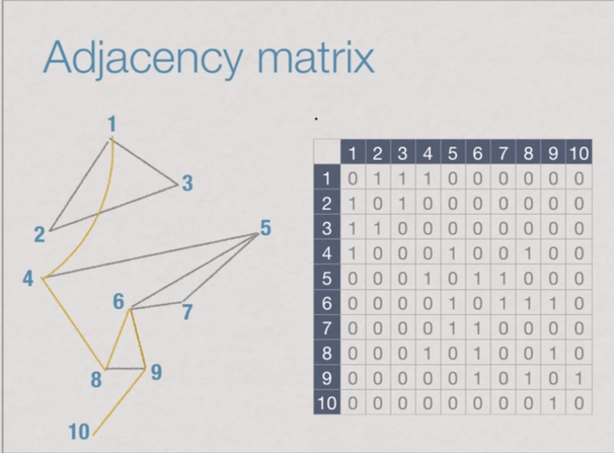
- Adjacency list
	- More time to find out whether j is a neighbour of i.
	- less space
	- less time to find out all neighbours of i.
	- 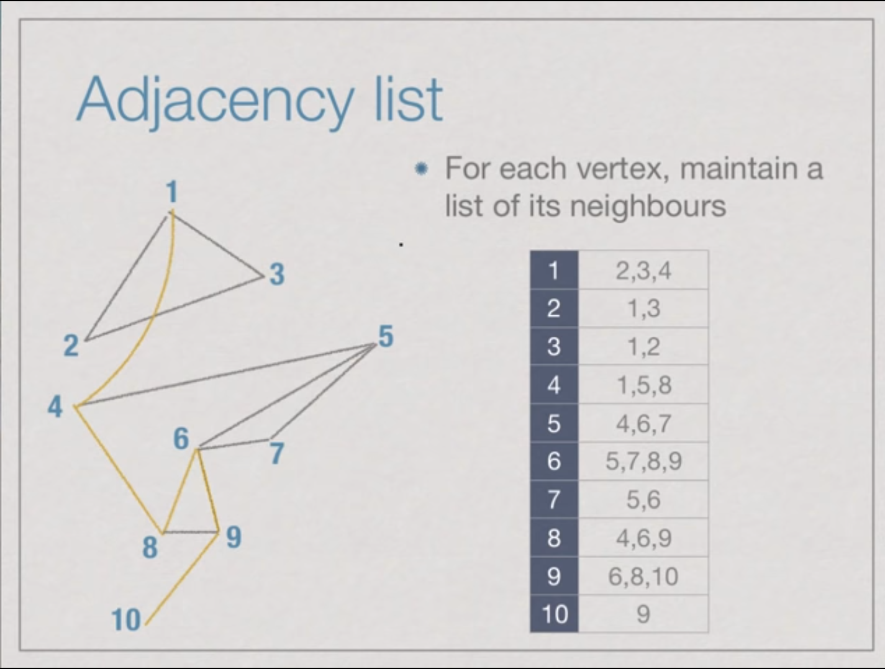

**Strategy for finding a path connecting a source vertex to a target vertex**

- Mark vertices that have been visited and keep track of vertices whose neighbours have already been explored.
- Avoid going round indefinately in circles

Start at the source vertex and start exploring using either of the below ways. 

- Breadth first search
	- level by level
- Depth first search
	- Go as deep as possible for every vertex


#### Breadth first search:

- Explore the graph level by level.
    - First visit vertices one step away.
    - Then two steps away.
    - Repeat this process till you have no more vertices.
- Remember which vertices have been visited.
- Also keep track of vertices visited, but whose neighbours are yet to be explored.

BFS:
- Array visited[i] records whether i has been visited.
- When a vertex is visited for the first time, add it to a queue.
- Explore vertices in the order they reach the queue.

Exploring a vertex:
```
    for each edge(i,j):
        if visited[j] == 0:
            visited[j] = 1
            append j to queue
```

- Initially, queue contains only source vertex
- At each stage, explore vertex at the head of the queue.
- Stop when the queue becomes empty.

#### Algo:
```
function BFS(i):
    for j = 1 to n:
        visited[j] = 0
    queue = []
    visited[i] = 1
    queue.append(i)
    while queue is not empty:
        j = extract_head(queue)
        for each (j,k) in E:
            if visited[k] == 0:
                visited[k] = 1
                queue.append(k)
```

Time complexity analysis:
- Each vertex enters Q exactly once.
- If graph is connected, loop to process Q iterated n times. 
    - For each j extracted from Q, need to examine all neighbours of j
    - In adjacency matrix, scan row j: n entries. 
- So, time complexity is O(pow(n,2)) - worst case

Can we reduce it? - **Yes**
- we can reduce it by using adjacency list instead of Adjacency matrix.
- Across the loop, each edge (i,j) is scanned twice. once when exploring i and again when exploring j.
- So, each node will be explored twice. We, can simply say that we are exploring all the edges once.
- So, overall exploring the neighbors takes times O(m). (m - no of edges)
- plus the algo again take O(n) for creating the visited array
- It becomes - O(n+m) - considered to be best case.

##### Python
```python
def dfs(self, i, adjacencyList):
	# Mark all the vertices as not visited
	visited = [0] * len(adjacencyList)
	# Create a queue for BFS
	queue = []
	# Mark the source node as visited and enqueue it
	visited[i] = 1
	queue.append(i)
	while len(queue):
		# Dequeue a vertex from queue and print it
		head = queue.pop(0)
		print (head, end = " ")
		# Get all adjacent vertices of the dequeued vertex s. If a adjacent
		# has not been visited, then mark it visited and enqueue it
		for j in adjacencyList[head] :
			if visited[j] == 0:
				visited[j] = 1
				queue.append(j)
adjacencyList = {0: [1, 2], 1: [2], 2: [0, 3], 3: [3]}
dfs(2, adjacencyList)
```

https://www.geeksforgeeks.org/queue-interface-java/

https://leetcode.com/tag/breadth-first-search/


##### Java
```java
// "static void main" must be defined in a public class.
public class Main {
    public static void main(String[] args) {
        int v = 4;
        LinkedList[] adj = new LinkedList[v];
        for (int i=0; i<v; ++i)
            adj[i] = new LinkedList();
        adj[0].add(1);
        adj[0].add(2);
        adj[1].add(2);
        adj[2].add(0);
        adj[2].add(3);
        adj[3].add(3);
        bfs(2, adj);
    }
    
    public static void bfs(int s, LinkedList[] adj){
        // Mark all the vertices as not visited(By default set as false)
        boolean[] visited = new boolean[adj.length];

        // Create a queue for BFS
        LinkedList<Integer> queue = new LinkedList<Integer>();

        // Mark the current node as visited and enqueue it
        visited[s] = true;
        queue.add(s);

        while(queue.size() != 0){
            // Dequeue a vertex from queue and print it
            s = queue.poll();
            System.out.println(s+" ");

            // Get all adjacent vertices of the dequeued vertex s
            // If a adjacent has not been visited, then mark it
            // visited and enqueue it
            Iterator<Integer> i = adj[s].listIterator();
            while(i.hasNext()){
                int n = i.next();
                if(!visited[n]){
                    visited[n] = true;
                    queue.add(n);
                }
            }
        }
    }
}
```
#### **Level order printing:**
##### Python
```python

# Input: root = [3,9,20,null,null,15,7]
# Output: [[3],[9,20],[15,7]]

# Definition for a binary tree node.
# class TreeNode:
#     def __init__(self, val=0, left=None, right=None):
#         self.val = val
#         self.left = left
#         self.right = right

# we can implement this in a different way as below java code, but writing to show a different variation and thought process.
class Solution:
    def levelOrder(self, root: TreeNode) -> List[List[int]]:
        ans, level = [], [root]
        while root and level:
            ans.append([node.val for node in level])
            LRPairs = [(node.left, node.right) for node in level]
            level = [node for pairs in LRPairs for node in pairs if node]
        return ans
```
Below is the recursive way of above implementation
##### Java
```java
/**
 * Input: root = [3,9,20,null,null,15,7]
 * Output: [[3],[9,20],[15,7]]
 * Definition for a binary tree node.
 * public class TreeNode {
 *     int val;
 *     TreeNode left;
 *     TreeNode right;
 *     TreeNode() {}
 *     TreeNode(int val) { this.val = val; }
 *     TreeNode(int val, TreeNode left, TreeNode right) {
 *         this.val = val;
 *         this.left = left;
 *         this.right = right;
 *     }
 * }
 */
class Solution {
    public List<List<Integer>> levelOrder(TreeNode root) {
        List<List<Integer>> ans = new ArrayList<List<Integer>>();
        levelHelper(root, ans, 0);
        return ans;
    }
    
    public void levelHelper(TreeNode node, List<List<Integer>> ans, int level){
        if(node == null) return;
        if(level >= ans.size()){
            ans.add(new ArrayList<Integer>());
        }
        ans.get(level).add(node.val);
        levelHelper(node.left, ans, level+1);
        levelHelper(node.right, ans, level+1);
    }
}
```

#### Find the path and level of a node from given ith vertex
- Path that is being used to visit node j from i. 
- parent array will be create and we have to backtrack it to find the path


#### Algo:
```
function BFS(i):
    for j = 1 to n:
        visited[j] = 0
        parent[j] = -1
    Queue = [i]
    visited[i] =1
    while queue is not empty:
        j = extract_head(queue)
        for each (j,k) in E:
            if visited[k] == 0:
                visited[k] = 1
                parent[k] = j
                queue.append(k)
```

#### Recording distance:
BFS can record how long the path is to each vertex.
Insted of binary arrat visited[], keep integer array level[]
level[j] = -1 initially
level[j] = p means j is reached in p steps from i

#### Algo:
```
function BFS(i):
    for j = 1 to n:
        level[j] = -1
        parent[j] = -1
    Queue = [i]
    level[i] = 0
    while queue is not empty:
        j = extract_head(queue)
        for each (j,k) in E:
            if level[k] == -1:
                level[k] = 1 + level[j]
                parent[k] = j
                queue.append(k)
```

##### Python
```python
# we get the path it followed to get to a target from ith vertex using parent array links
# We get the level of each node from a given ith vertex
def dfs(self, i, adjacencyList):
    # set all the nodes level and parent as -1
    level = [-1] * len(adjacencyList)
    parent = [-1] * len(adjacencyList)
    # Create a queue for BFS
    queue = []
    # Mark the source node as visited and enqueue it
    level[i] = 0
    queue.append(i)
    while len(queue):
        # Dequeue a vertex from queue and print it
        head = queue.pop(0)
        print (head, end = " ")
        # Get all adjacent vertices of the dequeued vertex head. If a adjacent
        # has not been visited, then mark it visited and enqueue it
        # simultaneously record the level and parent.
        for j in adjacencyList[head] :
            if level[j] == -1:
                level[j] = 1+level[head]
                parent[j] = head
                queue.append(j)
adjacencyList = {0: [1, 2], 1: [2], 2: [0, 3], 3: [3]}
dfs(2, adjacencyList)
```
##### Java
```java
// "static void main" must be defined in a public class.
public class Main {
    public static void main(String[] args) {
        int v = 4;
        LinkedList[] adj = new LinkedList[v];
        for (int i=0; i<v; ++i)
            adj[i] = new LinkedList();
        adj[0].add(1);
        adj[0].add(2);
        adj[1].add(2);
        adj[2].add(0);
        adj[2].add(3);
        adj[3].add(3);
        bfs(2, adj);
    }
    
    public static void bfs(int s, LinkedList[] adj){
        // Mark all the vertices as not visited(By default set as false)
        // use level and parent arrar to find out level and parent of a node.
        boolean[] visited = new boolean[adj.length];
        int[] level = new int[adj.length];
        int[] parent = new int[adj.length];

        // Create a queue for BFS
        LinkedList<Integer> queue = new LinkedList<Integer>();

        // Mark the current node as visited and enqueue it
        visited[s] = true;
        level[s] = 0;
        queue.add(s);

        while(queue.size() != 0){
            // Dequeue a vertex from queue and print it
            s = queue.poll();
            System.out.println(s+" ");

            // Get all adjacent vertices of the dequeued vertex s
            // If a adjacent has not been visited, then mark it
            // visited and enqueue it
            Iterator<Integer> i = adj[s].listIterator();
            while(i.hasNext()){
                int n = i.next();
                if(!visited[n]){
                    visited[n] = true;
                    level[n] = level[s] + 1;
                    parent[n] = s;
                    queue.add(n);
                }
            }
        }
    }
}
```

- If we add this level predicate to Breadth first search, then it actually gives us the shortest path to each node in terms of number of edges.
- Now, in general, we will see that, **if you do not have the uniform cost, we have different cost on edges, then the shortest path need not be just the shortest in term to number of edges. We have to add the cost associated to each path. these are called weighted graphs.**


------------

#### Depth first search

Depth first search instead of exploring all vertices level by level .Each time we explore a new vertex. then immediately explore it's children.

- Start from i, visit a neighbour j.
- Suspend the exploration of i and explore J instead.
- Continue till you reach a vertex with no unexplored neighbours.
- Backtrack to the nearest suspended vertex that still has an unexplored neighbour and repeat the same process.
- Suspended vertices are stored in a stack.
- Last in, first out (LIFO): most recently suspended is checked first.


- DFS is most natural to implement recursively
- For each unvisited neighbour j for i, call DFS(j)
- No need to explicitly maintain a stack
- Stack is maintained implicitly by recursive calls

#### Algo:
```
for j = 1 to n:
    visited[j] = 0
    parent[j] = -1
function DFS(i):
    visited[i] = 1
    for each (i,j) in E: // Adj matrix - O(n)
        if visited[j] == 0:
            parent[j] = i
            DFS(j)
```

Time complexity: Same as bfs - O(m+n) - If adjacency list is used.

##### Python
```python
def dfs(i):
    global visited
    global parent
    global adj
    visited[i] = 1
    print("current Node: ",i)
    for neighbour in adj[i]:
        if visited[neighbour] == 0:
            visited[neighbour] = 1
            parent[neighbour] = i
            dfs(neighbour)
adj = {0: [1, 2], 1: [2], 2: [0, 3], 3: [3]}
visited = [0] * len(adj)
parent = [-1] * len(adj)
dfs(2)
# 2 is the root node here
print("visited: ", visited)
print("parents : ",parent )
```
##### Java
```java
// "static void main" must be defined in a public class.
public class Main {
    public static void main(String[] args) {
        int v = 4;
        LinkedList<Integer>[] adj = new LinkedList[v];
        for (int i=0; i<v; ++i)
            adj[i] = new LinkedList();
        adj[0].add(1);
        adj[0].add(2);
        adj[1].add(2);
        adj[2].add(0);
        adj[2].add(3);
        adj[3].add(3);
        boolean[] visited = new boolean[adj.length];
        int[] parent = new int[adj.length];
        dfs(2, adj, visited, parent);
        for(boolean i : visited)
            System.out.println(i);
        for(int i : parent)
              System.out.println(i);
    }
    
    // instead of passing we can set them as globals
    public static void dfs(int s, LinkedList[] adj, boolean[] visited, int[] parent){

        // Mark the current node as visited
        visited[s] = true;
        System.out.println(s);

        Iterator<Integer> i = adj[s].listIterator();
        while(i.hasNext()){
            int n = i.next();
            if(!visited[n]){
                parent[n] = s;
                dfs(n, adj, visited, parent);
            }
        }
    }
}
```

Path discovered by Dfs is not the shortest path, then what are it's uses.
- DFS numbering
	- Computing the pre and post values of each node.
	- pre denotes the step at which this node is visited while exploring.
	- post denotes the step at which this node is visited while finishing the exploring of this node.
	- https://www.geeksforgeeks.org/printing-pre-and-post-visited-times-in-dfs-of-a-graph/
	- 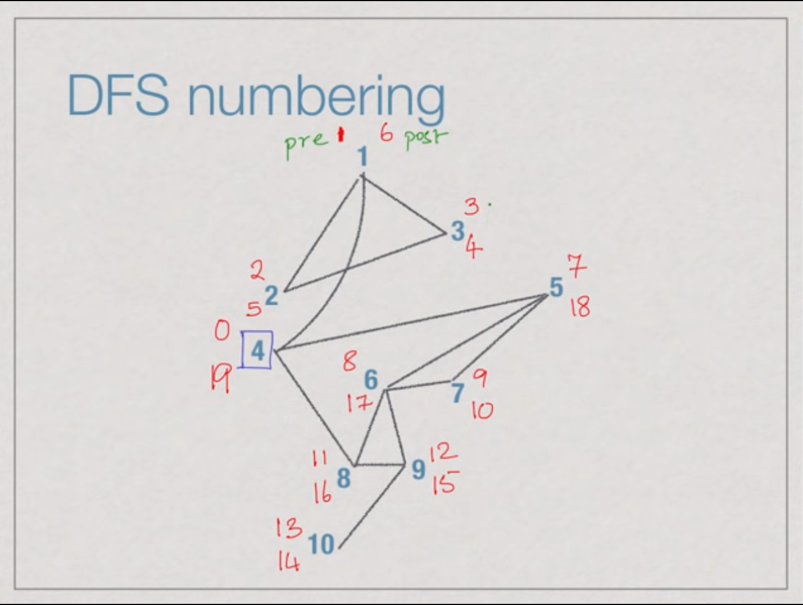
    - These pre and post can be used to find:
        - If the graph has a cycle or not
        - Cut vertex - removal of a vertex will disconnect the graph.
        - They can be used to find out whether a particular node lies in the sub-tree of another node. To find whether u lies in the sub-tree of v or not we just compare the pre and post number of u and v. If pre[u] > pre[v] and post[u] < post[v] then u lies in the sub-tree of v otherwise not.


#### Program to record pre and post values:
##### Python
```python
def dfs(i):
    global visited, parent, adj, pre, post, count
    visited[i] = 1
    pre[i] = count
    count+=1
    print("current Node: ",i)
    for neighbour in adj[i]:
        if visited[neighbour] == 0:
            visited[neighbour] = 1
            parent[neighbour] = i
            dfs(neighbour)
    post[i] = count
    count+=1
adj = {0: [1, 2, 3], 1: [0, 2], 2: [0, 1], 3: [0, 4,5,7], 4: [3,5,6], 5: [4,6,7], 6: [4,5], 7:[5,8], 8: [5, 7,9], 9:[8]}
visited = [0] * len(adj)
parent = [-1] * len(adj)
pre = [-1] * len(adj)
post = [-1] * len(adj)
count = 0
dfs(3)
# 2 is the root node here
print("visited: ", visited)
print("parents : ",parent )
print("pre : ",pre )
print("post : ",post )
```
##### Java
```java
public class Main {
    public static int count = 0;
    public static void main(String[] args) {
        int v = 4;
        LinkedList<Integer>[] adj = new LinkedList[v];
        for (int i=0; i<v; ++i)
            adj[i] = new LinkedList();
        adj[0].add(1);
        adj[0].add(2);
        adj[1].add(2);
        adj[2].add(0);
        adj[2].add(3);
        adj[3].add(3);
        boolean[] visited = new boolean[adj.length];
        int[] parent = new int[adj.length];
        int[] pre = new int[adj.length];
        int[] post = new int[adj.length];
        dfs(2, adj, visited, parent, pre, post);
        for(boolean i : visited)
            System.out.print(i);
        System.out.println("");
        for(int i : parent)
              System.out.print(i);
        System.out.println("");
        for(int i : pre)
              System.out.print(i);
        System.out.println("");
        for(int i : post)
              System.out.print(i);
    }
    
    // instead of passing we can set them as globals
    public static void dfs(int s, LinkedList[] adj, boolean[] visited, int[] parent, int[] pre, int[] post){

        // Mark the current node as visited
        visited[s] = true;
        System.out.println(s);
        pre[s] = count;
        count++;

        Iterator<Integer> i = adj[s].listIterator();
        while(i.hasNext()){
            int n = i.next();
            if(!visited[n]){
                parent[n] = s;
                dfs(n, adj, visited, parent, pre, post);
            }
        }
        post[s]=count;
        count++;
    }
}
```

One fundamental property of undirected graph is whether it is **connected or disconnected.**
- If we can go from every vertex to every other vertex, then the graph is connected graph. else disconnected.
- Each connected graph in a disconnected graph is termed as connected component. please view below diagram for clear understanding.

######
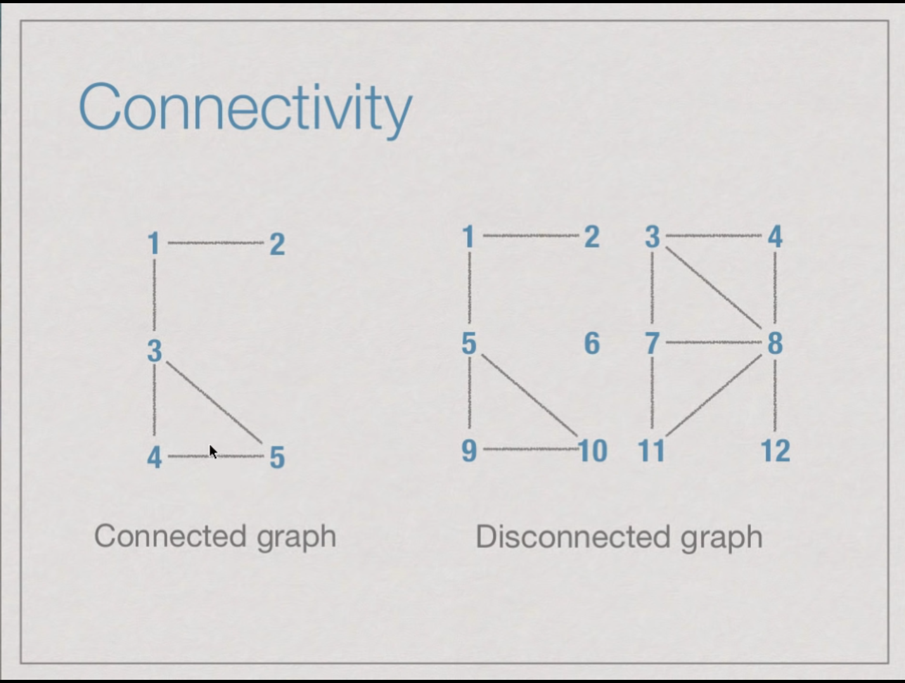
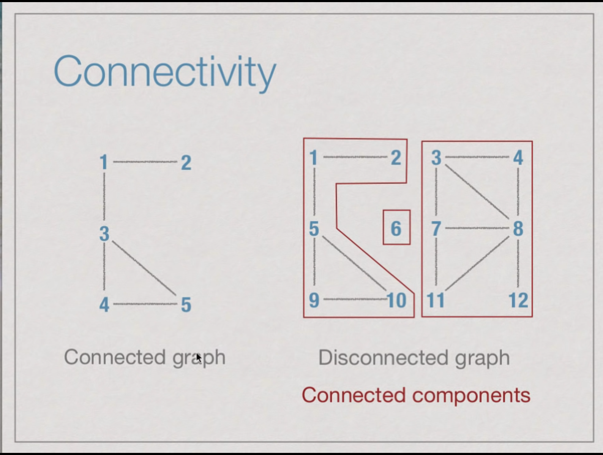

Steps to find out connected components:
- Start a bfs or dfs from node 1.
- mark each visited node.
- Now pick an unvisted node and repeat above process again.
- continue this till you have marked all the nodes as visited.

Either you can label each vertex to the component number it belongs to or print it component wise - Mold your output as per requirement.

##### Python
```python
def dfs(i, res = [], componentNumber = 1):
    global visited, adj, components
    visited[i] = 1
    res.append(i)
    components[i] = componentNumber
    for neighbour in adj[i]:
        if visited[neighbour] == 0:
            visited[neighbour] = 1
            dfs(neighbour, res, componentNumber)
    return res
adj = {0: [1], 1: [0, 2], 2: [1], 3: [4], 4: [3]}
visited = [0] * len(adj)
components = [-1] * len(adj)
noOfConnectedComponents = 0
for i in adj:
    if visited[i] == 0:
        noOfConnectedComponents+=1
        print(dfs(i, [], noOfConnectedComponents))
print(noOfConnectedComponents, components)
```
- This implementation directly prints each connected component.
- If we just want the count of the number of connected component, then maintain a variable which increments for each new dfs/bfs in the above implementation. OR- Maintain an component array where index i denotes the node and assign it the component number to which it belongs to.
##### Java
```java
public class Main {
    public static void main(String[] args) {
        int v = 5;
        LinkedList<Integer>[] adj = new LinkedList[v];
        for (int i=0; i<v; ++i)
            adj[i] = new LinkedList();
        adj[0].add(1);
        adj[1].add(2);
        adj[1].add(0);
        adj[2].add(1);
        adj[4].add(3);
        adj[3].add(4);
        boolean[] visited = new boolean[adj.length];
        int[] components = new int[adj.length];
        int count = 0;
        for(int i = 0; i < adj.length; i++){
            if(visited[i] == false){
                count++;
                List<Integer> res = new ArrayList<Integer>();
                dfs(i, adj, visited, res, components, count);
                for(Integer k : res)
                    System.out.print(k);
                System.out.println("");
            }
        }
        System.out.println(count);
    }
    
    public static void dfs(int s, LinkedList[] adj, boolean[] visited, List<Integer> res, int[] components, int count)     {
        visited[s] = true;
        res.add(s);
        components[s] = count;
        Iterator<Integer> i = adj[s].listIterator();
        while(i.hasNext()){
            int n = i.next();
            if(!visited[n]){
                dfs(n, adj, visited, res, components, count);
            }
        }
    }
}
```

Another Structural property of a graph is whether or not it has cycles. 

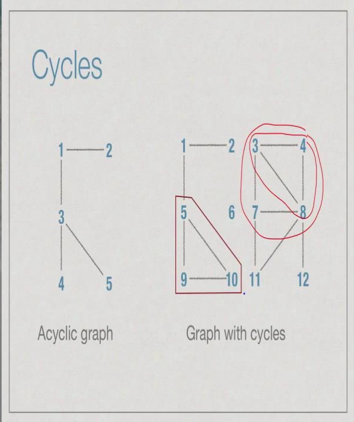

Procedure for finding cycles:

- Run BFS on a graph which has cycles then you will find that some edges are not used, because when you try to explore those edges, you find that target vertex is already visited.

**A connected acyclic graph is termed as Tree.**

So, in any graph if we explore BFS, the edges that are actually used will form a tree and this called a BFS tree. and remaining edges are called non tree edges

So, having a cycle is equivalent to finding a non tree edge while doing bfs.

We can use DFS as well to find the cycles.

##### Python
```python
def dfs(i):
    global visited, parent, adj, pre, post, count
    visited[i] = 1
    pre[i] = count
    count+=1
    print("current Node: ",i)
    for neighbour in adj[i]:
        if visited[neighbour] == 0:
            visited[neighbour] = 1
            parent[neighbour] = i
            dfs(neighbour)
        elif neighbour != parent[i]:
            print("cycle exist")
            
    post[i] = count
    count+=1
adj = {0: [1, 2, 3], 1: [0, 2], 2: [0, 1], 3: [0, 4,5,7], 4: [3,5,6], 5: [3,4,6,7], 6: [4,5], 7:[5,8], 8: [5, 7,9], 9:[8]}
visited = [0] * len(adj)
parent = [-1] * len(adj)
pre = [-1] * len(adj)
post = [-1] * len(adj)
count = 0
dfs(0)
# 2 is the root node here
print("visited: ", visited)
print("parents : ",parent )
print("pre : ",pre )
print("post : ",post )
```

##### Java
```Java
public class Main {
    public static int count = 0;
    public static void main(String[] args) {
        int v = 4;
        LinkedList<Integer>[] adj = new LinkedList[v];
        for (int i=0; i<v; ++i)
            adj[i] = new LinkedList();
        adj[0].add(1);
        adj[0].add(2);
        adj[1].add(2);
        adj[2].add(0);
        adj[2].add(3);
        adj[3].add(3);
        boolean[] visited = new boolean[adj.length];
        int[] parent = new int[adj.length];
        dfs(2, adj, visited, parent);
    }
    
    // instead of passing we can set them as globals
    public static void dfs(int s, LinkedList[] adj, boolean[] visited, int[] parent){

        // Mark the current node as visited
        visited[s] = true;
        System.out.println(s);

        Iterator<Integer> i = adj[s].listIterator();
        while(i.hasNext()){
            int n = i.next();
            if(!visited[n]){
                parent[n] = s;
                dfs(n, adj, visited, parent);
            }else if(parent[n] != s){
                System.out.println("Contains Cycles");
            }
        }
    }
}
```

https://www.geeksforgeeks.org/check-given-graph-tree/

Now we perform DFS on the below image, each connected component will generate a DFS tree.
And each non-tree edge will generate a cycle.

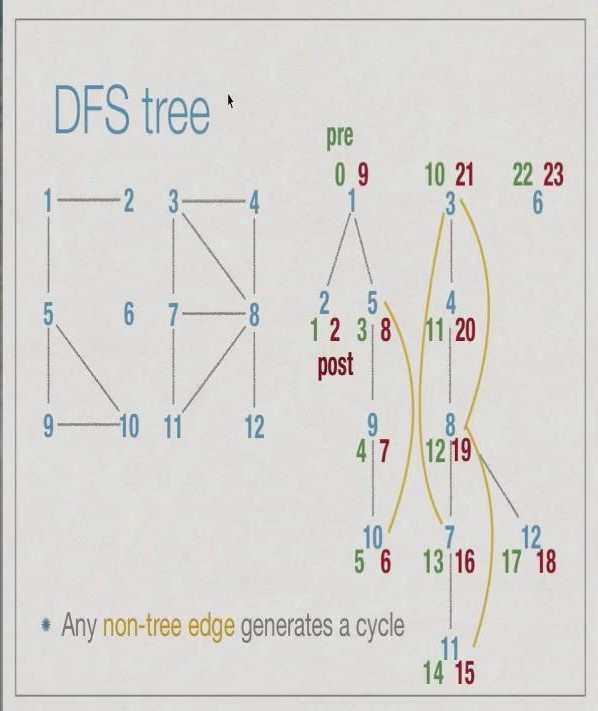

### Directed graphs

Applying dfs on the directed graph. Apart from tree edges, we also have non-tree edges.

And these non-tree edges are again divided into 3 types:
- **Forward edge**: these edges go from top level nodes to lower level nodes
- **Back edges**: this is opposite of forward edges. Goes from lower level to higher level
- **cross edge**: these edges goes from one child tree to other child tree. That too, from higher level to lower level. refer the image for clear understanding

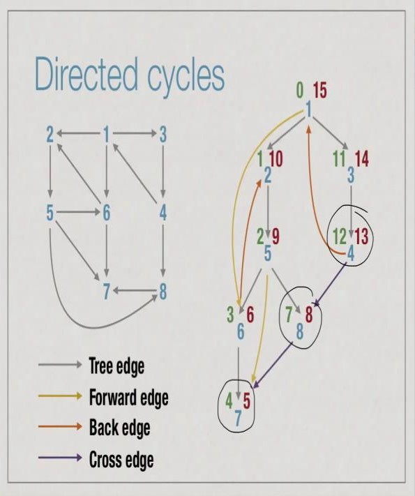

Now Which one of these will contribute for cycles?

Ans: A directed graph has a cycle if and only if DFS reveals a back edge

Can classify the type of edge using pre and post numbers:
- Tree/Forward edge (u,v):
    - Interval [pre(u), post(u)] contains [pre(v), post(v)]
- Backward edges (u,v):
    - Interval [pre(v), post(v)] contains [pre(u), post(u)]
- Cross edge (u,v):
    - Interval [pre(u), post(u)] and [pre(v), post(v)] are disjoint

Directed graphs without cycles are useful for modelling dependencies. example: Courses with prerequisites etc

Check [geeksForGeeks](https://www.geeksforgeeks.org/detect-cycle-in-a-graph/)

#### Connectivity in directed graphs:
Strongly connected: If there is a path from i to j and path from j to i. then it is strongly connected
- Directed graph can be decomposed into strongly connected components (SCCs)
    - All pairs of nodes in an SCC are strongly connected.
    - 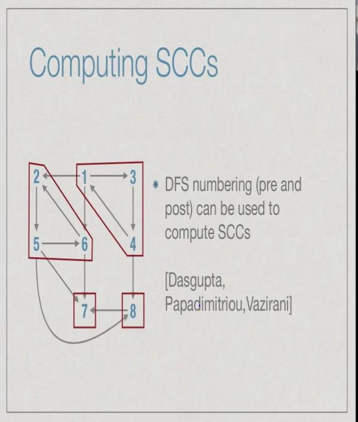

A number of other structural properties can be inferred from DFS numbering
- Articulation points (vertices)
    - Removing such a vertex disconnects the graph
- Bridges (edges)
    - Removing such an edge disconnects the graph

#### Directed acyclic graphs (DAG)
- G = (V,E), a directed graph
- No cycles:
	- No directed path from any v in V back to itself
- Such a graph is called DAG

Below is an example of DAG

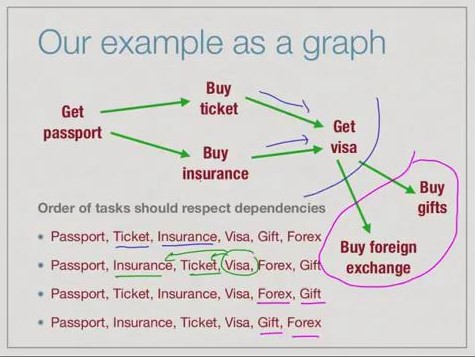

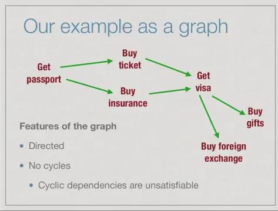

#### Topological ordering:
- Given a DAG G = (V,E), V = {1,2,...,n}
- Enumerate the vertices as {i1,i2,...,in} so that
	- for any edge (j,k) in E,
 		- j appears before k in the enumeration
- This is called topological sorting (Arranging the tasks in the order such that they maintain the constraints - please refer above example related to buying gifts)

##### Observation:
- A directed graph with cycles cannot be topologically ordered
- Path from j to k and from k to j means
	- j must come before k
	- k must come before j
	- Impossible

Every directed acyclic grpah can be topologically ordered.

Strategy:
- First list vertices with no incoming edges.
- Then list vertices whose incoming neighbours are already listed.
- indegree(v) : Number of edges into v
- outdegree(v): Number of edges out of v
- **Every dag has at least one vertex with indegree 0**
	- Start with any v such that indegree(v) > 0
	- Walk backwards to a predecessor so long as indegree > 0
	- If no vertex has indegree 0, within n steps we will complete a cycle

##### Algo:
```
- Pick a vertex with indegree 0
	- No dependencies
	- Enumerate it and delete it from the graph
- What remains is again a DAG!
- Repeat the above step
	- Stop when the resulting DAG is empty
```

Algo implementation Example :

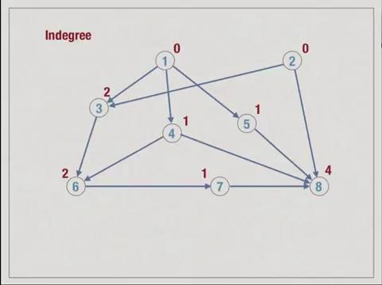

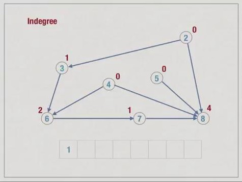

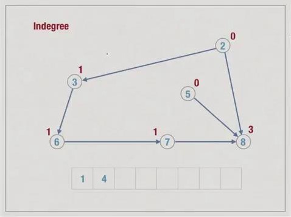

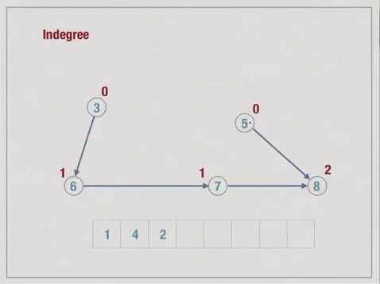


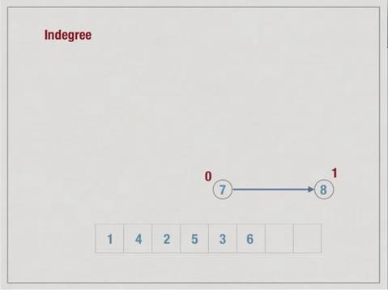

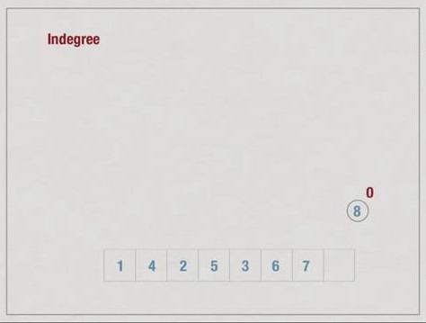

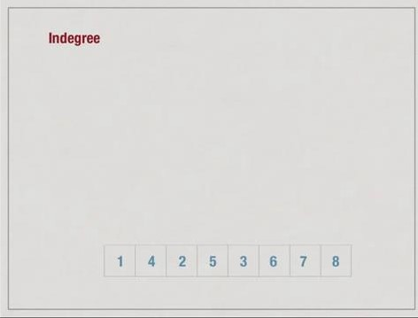

Sudo Code:
```
function TopologicalOrder(G):
	// find the indegrees of all vertexes
	for vertex i = 1 to n:
	  indegree[i] = 0
	  for vertex j = 1 to n:
		indegree[i]+=AdjacencyMatrix[j][i]
	
	for vertex i = 1 to n:
		choose vertex  with indegree[j] = 0
		enumerate j
		indegree[j] = -1 -> indicating that this is processed and removed
		// now reducing the indegree of all the vertices which are linked to j
		for vertex k = 1 to n:
			if AdjacencyMatrix[j][k] == 1:
				indegree[k]-=1
```

Time complexity:

- Complexity is O(pow(n,2))
    - Intializing indegree takes time O(pow(n,2))
    - Loop n times to enumerate vertices
        - Inside loop, identifying next vertex is O(n)
        - Updating indegrees of neighbours is O(n))

Time complexity can be reduced by using adjacency list.
Using adjacency list:
- Scan the list for computing the indegrees - O(m)
- Put all indegree 0 vertices in a queue
- Enumerate head of queue and decrement indegree of neighbours - degree(j), overall O(m)
	- If indegree becomes 0, add to queue.
- Overall O(m+n)

```
function topologicalSort(G):
	for vertex i = 1 to n:
		indegree[i] = 0
	for vertex i = 1 to n:
		for (i,j) in E:
			indegree[j]+=1
	for vertex i = 1 to n:
		if indegree[i] == 0:
			add i to Queue
	while Queue is not empty:
		j = remove_head(Queue)
		for (j,k) in E:
			indegree[k]-=1
			if indegree[k] == 0:
				add k to Queue
```

#### DAGs: Longest Path:

Problem Solving with DAGs and Topological sorting:

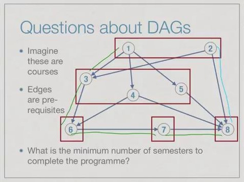

Longest path in a DAG
- Equivalent to finding longest path in DAG
- If indegree(j) = 0, longest_path_to(j) = 0
- if indegree(k) > 0, longest_path_to(k) is 1 + max( longest_path_to(j) ) - among all incoming neighbours j of k
- if j is an incoming neighbour (j,k) in E
	- j is enumerated before k in topological order
- Hence, compute longest_path_to(i) in topological order.

------

- Let i1, i2, ..., i3 be a topological ordering of V
- All neighbours of ik appear before it in this list
- From left to right, compute longest_path_to(ik) as 1+ max(longest_path_to(ij)) among all incoming neighbours ij of ik
- Can combine this calculation with topological sort


Example for finding the longest path in combination with topological sorting:

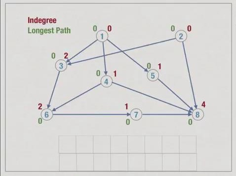
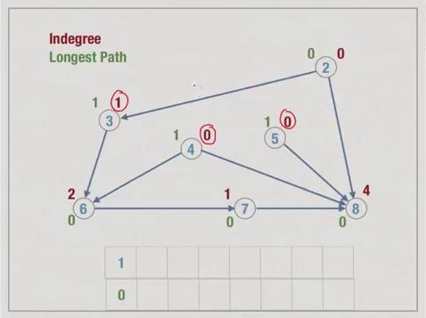
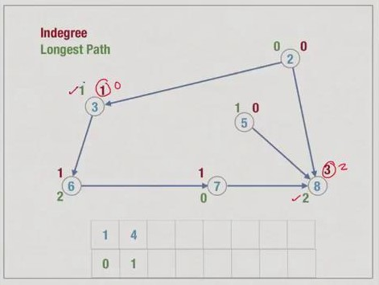
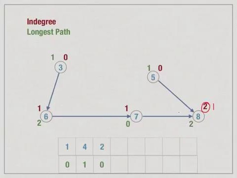
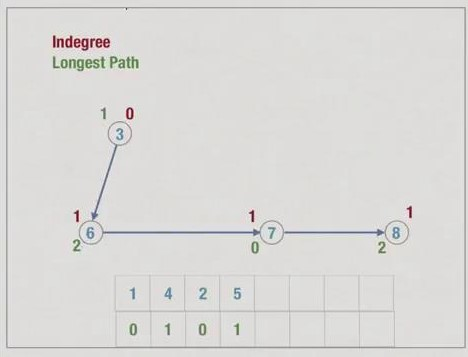
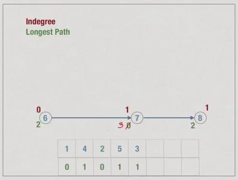
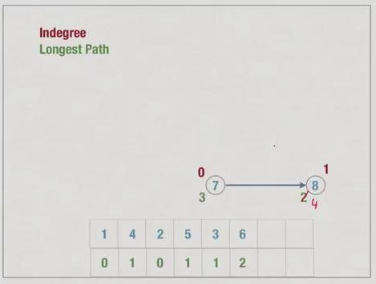
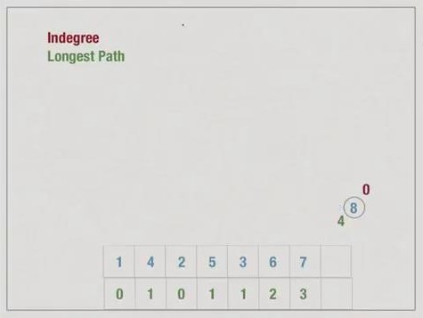
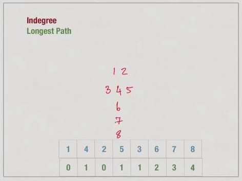

Algo:

```
function TopologicalOrderWithLongestPath(G):
    for vertex i = 1 to n:
        indegree[i] = 0
        LPT[i] = 0
        for vertex j = 1 to n:
            indegree[i] = indegree[i] + A[j][i]
    for vertex i = 1 to n:
        choose j with indegree[j] = 0
            enumerate j
            indegree[j] = -1
            for vertex k = 1 to n:
                if A[j][k] == 1:
                    indegree[k]-=1
                    LPT[k] = max(LPT[k], 1+LPT[j])
```

This implementation has complexity O(pow(n,2))
As before, we can use adjacency lists to improve the complexity to O(m+n)

```
function TopologicalOrder(G):
    for vertex i = 1 to n:
        indegree[i] = 0
        LPT[i] = 0

    for vertex i = 1 to n:
        for (i,j) in E:
            indegree[j]+=1
    
    for vertex i = 1 to n:
        if indegree[i] == 0:
            add i to queue
    
    while queue is not empty:
        j = remove_head(queue)
        for (j,k) in E:
            indegree[k]-=1
            LPT[k] = max(LPT[k], 1+MPT[k])
            if indegree[k] == 0:
                add k to queue
```

- Dependencies are naturally modelled using DAGs
- Topological ordering lists vertices without violating dependencies.
- Longest path in a DAG represent minimum number of steps to list all vertices in groups
- Note: Computing the longest path with no duplicates vertices in an arbitary graph is not known to have any efficient algorithm
