### Shortest paths in weighted grpahs

##### Recall:

- BFS and DFS are two systematic ways to explore a graph
    - Both take time linear in the size of the graph with adjacency lists.
- Recover paths by keeping parent information.
- BFS can compute shortest paths, in terms of number of edges
- DFS numbering can reveal many interesting features.

Adding edge weights:
- Ticket price on a flight sector.
- Tolls on highway segment.
- Distance travelled betweem two station.
- Typical time between two locations during peak hour traffic.

Weighted graph:
- G = (V,E) together with
- Weight function c: E-> Reals
- Let e1 = (v0,v1), e2 = (v1,v2) .... en=(vn-1, vn) be a pth from v1 to vn
- Cost of the path is w(e1) + w(e2) + w(e3) +....w(en)
- Shortest path from v0 to vn: minimum cost

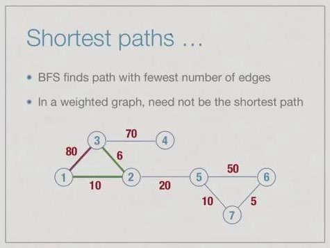

#### Shortest path problems:

- Single source
    - Find shortest paths from some fixed vertex, say 1 to every other vertex
    - Transport finished product from factory (single source) to all retail outlets
    - Courier company delivers items from distribution centre (single source) to addresses
- All pairs
    - Find shortest paths between every pair of vertices i and j
    - Railway routes, shortest way to travel between any pair of cities.


### Single source shortest paths

- Imagine vertices are oil depots, edges are pipelines
- Set fire to oil depot at vertex 1
    - Fire travels at uniform along each pipeline
- First oil depot to catch fire after 1 is the nearest vertex
- Next oil depot is second nearest vertex

Let consider below example and follow the images:

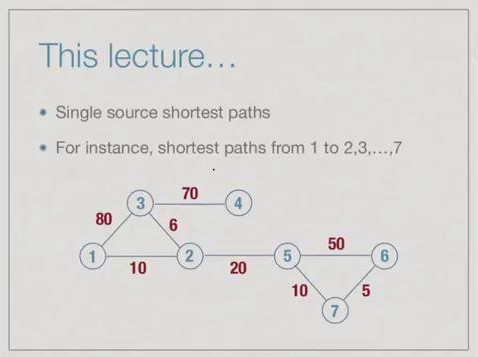

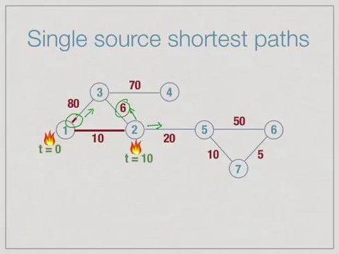

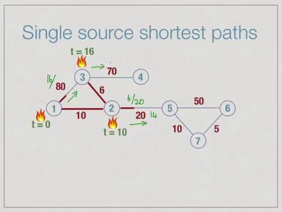

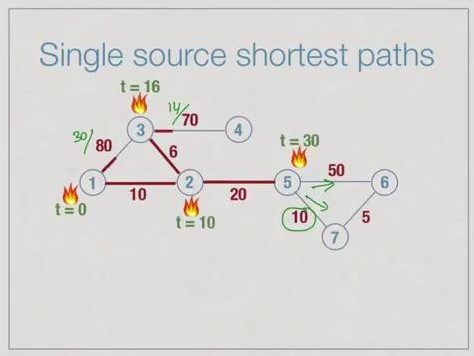

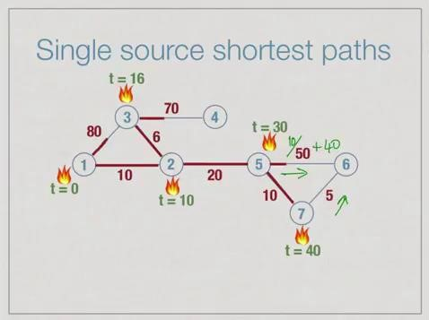

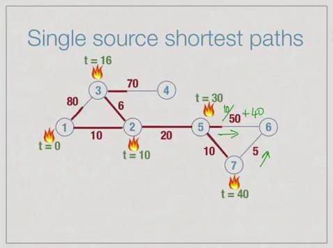

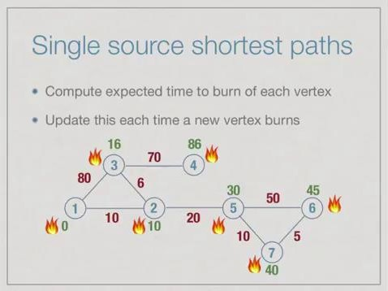

We can implement same logic to the Shortest path finding from source.

Algo for above example:
```
- Maintain two arrays
    - BurntVertices[], intially False for all i
    - ExpectedBurnTime[], intially infinate for all i
    - For infinate, use sum of all edges weights + 1
- Set ExpectedBurnTime[1] = 0
- Repeat, until all vertices are burnt
    - Find j with minimum ExpectedBurnTime
    - Set BurntVertices[j] = True
    - Recompute ExpectedBurnTime[k] for each neigbour k of j - (updates it if existing ExpectedBurnTime is greater than the current ExpectedBurnTime)
```
Algo implementation:
```
function shortestPaths(s):
    for vertex i = 1 to n:
        BV[i] = False
        EBT[i] = infinity
    EBT[s] = 0
    for vertex i = 1 to n:
        choose u such that BV[u] == False and EBT[u] is minimum
        BV[u] = True
        for each edge (u,v) with BV[v] == False:
            if EBT[v] > EBT[u] + weight(u,v):
                EBT[v] = EBT[u] + weight(u,v)
```

Converting this to shortest distance scenario.

This is the Dijkstra's algorithm.
```
- Maintain two arrays
    - visited[], intially False for all i
    - distance[], intially infinate for all i
    - For infinate, use sum of all edges weights + 1
- Set distance[1] = 0
- Repeat, until all vertices are burnt
    - Find j with minimum distance
    - Set visited[j] = True
    - Recompute distance[k] for each neigbour k of j - (updates it if existing distance is greater than the current distance)
```

Algo implementation:
```
function shortestPaths(s):
    for vertex i = 1 to n:
        visited[i] = False
        distance[i] = infinity
    distance[s] = 0
    for vertex i = 1 to n:
        choose u such that visited[u] == False and distance[u] is minimum
        visited[u] = True
        for each edge (u,v) with visited[v] == False:
            if distance[v] > distance[u] + weight(u,v):
                distance[v] = distance[u] + weight(u,v)
```

Eaxmple & Implentation: Link

This algo comes under **greedy algorithms.**

- Algorithm makes a sequence of choices.
- Next choice is based on "current best value".
    - Never go back and change a choice.
- Dijkstra's algorithm is greedy.
    - Select vertex with minimum expected burn time.
- Need to prove that greedy strategy is optimal.
- Most times, greedy approach fails.
    - Current best choice may not be globally optimal.

#### How correct is this algo - **Correctness**

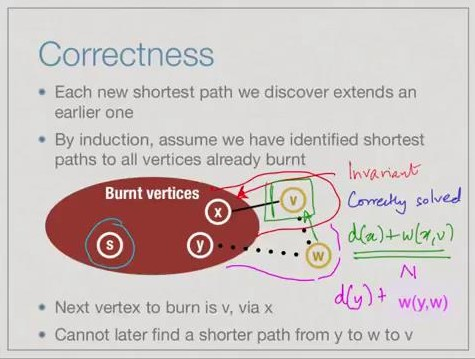

#### Complexity
- Outer loop runs n times.
    - In each iteration, we burn one vertex
    - O(n) scan to find minimum burn time vertex.
- Each time we burn a vertex v, we have to scan all its neighbours to - update burn times.
    - O(n) scan of adjacency matrix to find all neighbours
- Overall **O(pow(n,2))**

Can we reduce it? - **yes**

- Can maintain ExpectedBurnTime in a more sophisticared data structure-yes
    - Different types of trees (heaps, red-black trees) allow both of the following in O(log n) time
        - find and delete minimum
        - insert or update a value
- With such a tree
    - Finding minmum burn time vertex takes O(log n).
    - with adjacency list, updating burn times take O(log n) each, total O(m) edges.
- Overall O(nlog n + mlog n) = **O((m+n) logn)**

#### Limitations

What if we have negative weights?


#### Why negative weights?

- Weights represent money.
    - Taxi driver earns money from airport to city, travels empty to next pick-up point.
    - Some segments earn money, some lose money.
- Chemistry
    - Nodes are compounds, edges are reactions.
    - Weights are energy absorbed/released by reaction.

#### Handling negative edges
- Negative cycle: loop with a negative total weight
    - Problem is not well defined with negative cycles
    - Repeatedly traversing cycle pushed down cost without a bound.
- With negative edges, but no negative cycles, other algorithms exist like
    - Bellman-Ford
    - Floyd-Warshall all pairs shortest path.

----------

### Negative Edges: Bellman Ford Algorithm


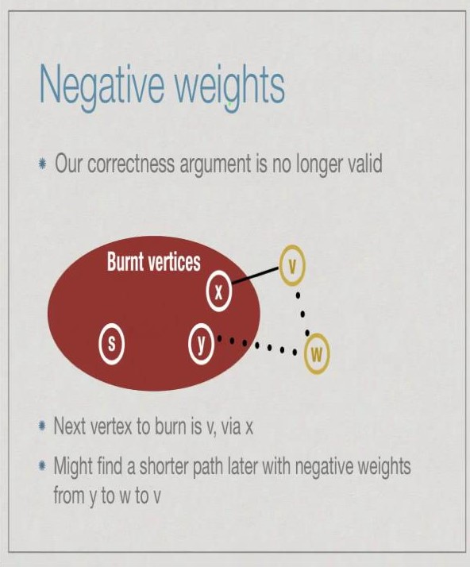

- **Negative cycle**: Loop with a negative total weight.
    - Problem is not well defined with negative cycles.
    - Repeatedly traversing cycle pushes down cost without a bound.
- With negative edges, but no negative cycles, shortest path do exist.

#### About shortest paths
- Shortest paths will never loop
    - Never visit the same vertex twice
    - At most length n-1
- Every prefix of a shortest path is itself a shortest path.
    - Support the shortest path from s to t is
        - s -> v1 -> v2 -> v3....-> vm -> t
    - Every prefix s -> v1 -> ....-> vr is a shortest path to vr

Properties of update(j,k)
```
update(j,k):
    distance(k) = min(distance(k), distance(j)+ weight(j,k))
```
- distance(k) is no more than distance(j) + weight(j,k)
- if distance(j) is correct and j is the second-last node on shortest path to k, distance(k) is correct.
- Update is safe
    - distance(k) never become "too small".
    - redundant updates cannot hurt.


- Dijkstra algorithm performs a particular "greedy" sequence of updates.
    - Computes shortest paths without negative weights
- With negative edges, this sequence does not work
- Is there some sequence that does work?

- Support the shortest path from s to t is
-     s -> v1 -> v2 -> .... > vm -> t
- If our update sequence includes ...,update(s,v1)...,update(v1,v2),...,update(v2,v3),......update(vm,t),..in that order, distance(t) will be computed correctly
- if distance(j) is correct and j is the second-last node on shortest path to k, distance(k) is correct after update(j,k).


Algo:
```
function BellmanFord(s): // source with -ve weights
    for vertex i = 1 to n:
        distance[i] = infinity
    distance[s] = 0
    for vertex i = 1 to n-1: // repeats n times
        for each edge(j,k) in E:
            distance(k) = min(distance[k], distance(j)+weight(j,k))
```

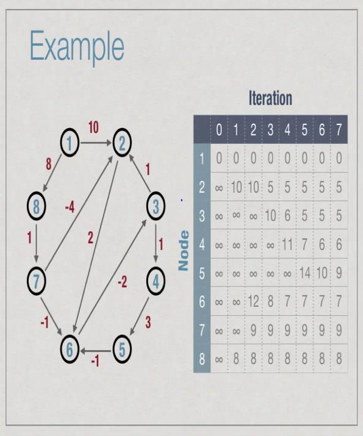

Implementation: https://www.geeksforgeeks.org/bellman-ford-algorithm-dp-23/ 

##### Complexity Analysis:
- Outer loop runs n times
- In each loop, for each edge (j,k), we run update(j,k)
    - Adjacency matrix - O(pow(n,2)) to identify all edges
    - Adjacency list - O(m)
- Overall
    - Adjacency matrix - O(pow(n,3))
    - Adjacency list - O(mn)


