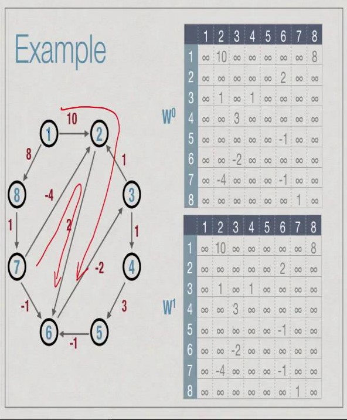
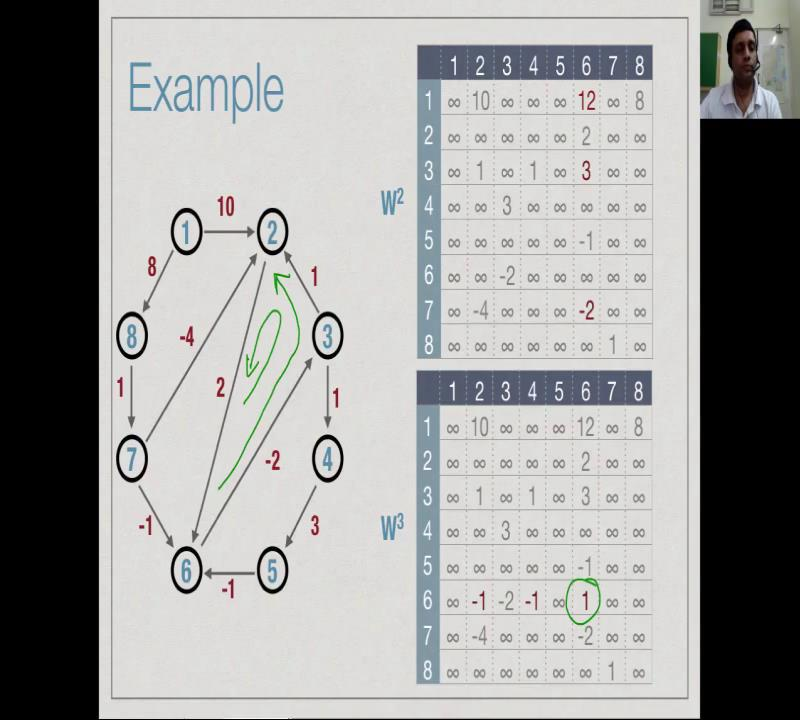
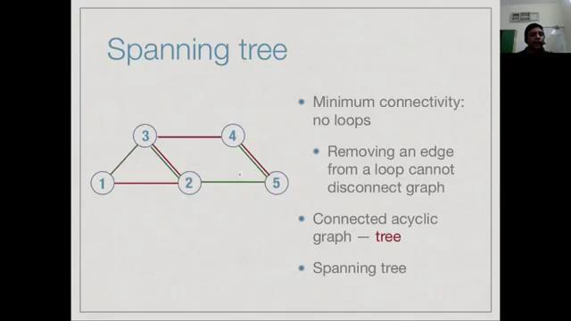
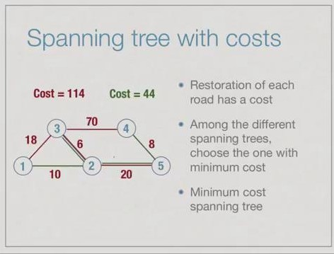

### Shortest paths in weighted grpahs

##### Recall:

- BFS and DFS are two systematic ways to explore a graph
    - Both take time linear in the size of the graph with adjacency lists.
- Recover paths by keeping parent information.
- BFS can compute shortest paths, in terms of number of edges
- DFS numbering can reveal many interesting features.

Adding edge weights:
- Ticket price on a flight sector.
- Tolls on highway segment.
- Distance travelled betweem two station.
- Typical time between two locations during peak hour traffic.

Weighted graph:
- G = (V,E) together with
- Weight function c: E-> Reals
- Let e1 = (v0,v1), e2 = (v1,v2) .... en=(vn-1, vn) be a pth from v1 to vn
- Cost of the path is w(e1) + w(e2) + w(e3) +....w(en)
- Shortest path from v0 to vn: minimum cost


#### Shortest path problems:

- Single source
    - Find shortest paths from some fixed vertex, say 1 to every other vertex
    - Transport finished product from factory (single source) to all retail outlets
    - Courier company delivers items from distribution centre (single source) to addresses
- All pairs
    - Find shortest paths between every pair of vertices i and j
    - Railway routes, shortest way to travel between any pair of cities.


### Single source shortest paths

- Imagine vertices are oil depots, edges are pipelines
- Set fire to oil depot at vertex 1
    - Fire travels at uniform along each pipeline
- First oil depot to catch fire after 1 is the nearest vertex
- Next oil depot is second nearest vertex

Let consider below example and follow the images:


We can implement same logic to the Shortest path finding from source.

Algo for above example:
```
- Maintain two arrays
    - BurntVertices[], intially False for all i
    - ExpectedBurnTime[], intially infinate for all i
    - For infinate, use sum of all edges weights + 1
- Set ExpectedBurnTime[1] = 0
- Repeat, until all vertices are burnt
    - Find j with minimum ExpectedBurnTime
    - Set BurntVertices[j] = True
    - Recompute ExpectedBurnTime[k] for each neigbour k of j - (updates it if existing ExpectedBurnTime is greater than the current ExpectedBurnTime)
```
Algo implementation:
```
function shortestPaths(s):
    for vertex i = 1 to n:
        BV[i] = False
        EBT[i] = infinity
    EBT[s] = 0
    for vertex i = 1 to n:
        choose u such that BV[u] == False and EBT[u] is minimum
        BV[u] = True
        for each edge (u,v) with BV[v] == False:
            if EBT[v] > EBT[u] + weight(u,v):
                EBT[v] = EBT[u] + weight(u,v)
```

Converting this to shortest distance scenario.

This is the Dijkstra's algorithm.
```
- Maintain two arrays
    - visited[], intially False for all i
    - distance[], intially infinate for all i
    - For infinate, use sum of all edges weights + 1
- Set distance[1] = 0
- Repeat, until all vertices are burnt
    - Find j with minimum distance
    - Set visited[j] = True
    - Recompute distance[k] for each neigbour k of j - (updates it if existing distance is greater than the current distance)
```

Algo implementation:
```
function shortestPaths(s):
    for vertex i = 1 to n:
        visited[i] = False
        distance[i] = infinity
    distance[s] = 0
    for vertex i = 1 to n:
        choose u such that visited[u] == False and distance[u] is minimum
        visited[u] = True
        for each edge (u,v) with visited[v] == False:
            if distance[v] > distance[u] + weight(u,v):
                distance[v] = distance[u] + weight(u,v)
```

Eaxmple & Implentation: Link

This algo comes under **greedy algorithms.**

- Algorithm makes a sequence of choices.
- Next choice is based on "current best value".
    - Never go back and change a choice.
- Dijkstra's algorithm is greedy.
    - Select vertex with minimum expected burn time.
- Need to prove that greedy strategy is optimal.
- Most times, greedy approach fails.
    - Current best choice may not be globally optimal.

#### How correct is this algo - **Correctness**


#### Complexity
- Outer loop runs n times.
    - In each iteration, we burn one vertex
    - O(n) scan to find minimum burn time vertex.
- Each time we burn a vertex v, we have to scan all its neighbours to - update burn times.
    - O(n) scan of adjacency matrix to find all neighbours
- Overall **O(pow(n,2))**

Can we reduce it? - **yes**

- Can maintain ExpectedBurnTime in a more sophisticared data structure-yes
    - Different types of trees (heaps, red-black trees) allow both of the following in O(log n) time
        - find and delete minimum
        - insert or update a value
- With such a tree
    - Finding minmum burn time vertex takes O(log n).
    - with adjacency list, updating burn times take O(log n) each, total O(m) edges.
- Overall O(nlog n + mlog n) = **O((m+n) logn)**

#### Limitations

What if we have negative weights?


#### Why negative weights?

- Weights represent money.
    - Taxi driver earns money from airport to city, travels empty to next pick-up point.
    - Some segments earn money, some lose money.
- Chemistry
    - Nodes are compounds, edges are reactions.
    - Weights are energy absorbed/released by reaction.

#### Handling negative edges
- Negative cycle: loop with a negative total weight
    - Problem is not well defined with negative cycles
    - Repeatedly traversing cycle pushed down cost without a bound.
- With negative edges, but no negative cycles, other algorithms exist like
    - Bellman-Ford
    - Floyd-Warshall all pairs shortest path.

----------

### Negative Edges: Bellman Ford Algorithm


- **Negative cycle**: Loop with a negative total weight.
    - Problem is not well defined with negative cycles.
    - Repeatedly traversing cycle pushes down cost without a bound.
- With negative edges, but no negative cycles, shortest path do exist.

#### About shortest paths
- Shortest paths will never loop
    - Never visit the same vertex twice
    - At most length n-1
- Every prefix of a shortest path is itself a shortest path.
    - Support the shortest path from s to t is
        - s -> v1 -> v2 -> v3....-> vm -> t
    - Every prefix s -> v1 -> ....-> vr is a shortest path to vr

Properties of update(j,k)
```
update(j,k):
    distance(k) = min(distance(k), distance(j)+ weight(j,k))
```
- distance(k) is no more than distance(j) + weight(j,k)
- if distance(j) is correct and j is the second-last node on shortest path to k, distance(k) is correct.
- Update is safe
    - distance(k) never become "too small".
    - redundant updates cannot hurt.


- Dijkstra algorithm performs a particular "greedy" sequence of updates.
    - Computes shortest paths without negative weights
- With negative edges, this sequence does not work
- Is there some sequence that does work?

- Support the shortest path from s to t is
-     s -> v1 -> v2 -> .... > vm -> t
- If our update sequence includes ...,update(s,v1)...,update(v1,v2),...,update(v2,v3),......update(vm,t),..in that order, distance(t) will be computed correctly
- if distance(j) is correct and j is the second-last node on shortest path to k, distance(k) is correct after update(j,k).


Algo:
```
function BellmanFord(s): // source with -ve weights
    for vertex i = 1 to n:
        distance[i] = infinity
    distance[s] = 0
    for vertex i = 1 to n-1: // repeats n times
        for each edge(j,k) in E:
            distance(k) = min(distance[k], distance(j)+weight(j,k))
```


Implementation: https://www.geeksforgeeks.org/bellman-ford-algorithm-dp-23/ 

##### Complexity Analysis:
- Outer loop runs n times
- In each loop, for each edge (j,k), we run update(j,k)
    - Adjacency matrix - O(pow(n,2)) to identify all edges
    - Adjacency list - O(m)
- Overall
    - Adjacency matrix - O(pow(n,3))
    - Adjacency list - O(mn)

---------------

### All shortest paths
- Negative weight are allowed, but not negative cycles.
- Shortest paths are still well defined
- Bellman-Ford algorithm computes single-source shortest paths
- Can we compute shortet paths between all pairs of vertices?
- Shortest paths will never loop
    - Never visit the same verte twice
    - At most length n-1
- Use this to inductively explore all possible shortest paths efficicently

#### Inductively exploring shortest paths
- Simplest shortest path from i to j is a direct edge (i,j)
- General case:
    - i -> v1 -> v2 -> v3 -> .... -> vm -> j
    - All of (v1, v2,v3,...,vm) are distinct and different from i to j
    - Restrict what vertices can appear in this set.

**Anlaysis:**
- Recall that V = {1,2,...,n}
- Wk(i,j): weight of shortest path from i to j among paths that only go via {1,2,...,k}
    - {k+1, ..., n } cannot appear on the path
    - i, j themselves need to be in {1,2,....,k}
- W0(i,j): direct edges
    - {1,2,3,...,n} cannot appear betweeen i and j
- From Wk-1(i,j) to Wk(i,j)
    - Case 1: Shortest path via {1,2,...,k} does not use vertex k
        - Wk(i,j) = Wk-1(i,j)
    - Case 2: Shortest path via {1,2..k} does go via k
        - k can appear only once along this path
        - Break up as paths i to k and k to j, each via {1,2,..,k-1}
        - Wk(i,j) = Wk-1(i,k) + Wk-1(k,j)
- Conclusion: Wk(i,j) = min(Wk-1(i,j), Wk-1(i,k) + Wk-1(k,j))


#### Floyd Warshall algorithm
- W0 is adjacency matrix with edge weights
    - W0(i,j) = weight(i,j) if there is an edge (i,j), otherwise infinate
- For k in 1,2,..,n
    - Compute Wk(i,j) from Wk-1 using Wk(i,j) = min(Wk-1(i,j), Wk(i,k)+Wk-1(k,j))
- Wn contains weights of shortest path for all pairs.

#### Algo:
```
Function FloydWarshall:
    for vertex i = 1 to n:
        for vertex j = 1 to n:
            W[i][j][0] = infinite
    for each edge (i,j) in E:
        W[i][j][0] = weight(i,j)
    
    for k = 1 to n:
        W[i][j][k] = min(W[i][j][k-1], W[i][k][k-1] + W[k][j][k-1])
```

Example:





#### Complexity Analysis:
- Easy to see that the compleity is O(pow(n,3))
    - n iterations.
    - In each iteration, we update pow(n,2) entries.
- A word about space complexity
    - Navie Implementation is O(pow(n,3)) - W[i][j][k]
    - Only need two "slices" at a time, W[i][j][k-1] and W[i][j][k]
    - Space requirement reduces to O(pow(n,2))

Historical remarks:

- Floyd-Warshall is a hybrid name
- Warshall originally proposed an algorithm for transitive closure
    - Generating path matrix P[i][j] from adjacency matri A[i][j]
- Floyd adapted it to compute shortest paths.

Computing paths:
- A(i,j) = 1 if there is an edge from i to j
- Want P(i,j) = 1 if there is a pth from i to j
- Iteratively compute Pk(i,j) = 1 if there is a path from i to j where all intermediate vertices are in {1,2,...,k}
    - {k+1,...,n} cannot appear on the path
    - i, j themselves need not be in {1,2,...,k}
- P0(i,j) = A(i,j) : direct edges
    - {1,2,..,n} cannot appear between i and j


Inductively computing P[i][j]
- From Pk-1(i,j) to Pk(i,j)
- Case 1: There is a path from i to j without using vertex k
    - Pk(i,j) = Pk-1(i,j)
- Case 2: Path via {1,2,...,k} does go via k
    - k can appear only once along this path
    - Break up as paths i to k and k to j each via {1,2,..k-1}
    - Pk(i,j) = Pk-1(i,k) and Pk-1(k,j)
- Conclusion: Pk(i,j) = Pk-1(i,j) or (Pk-1(i,k) and Pk-1(k,j))

Warshall's algorithm
```
function Warshall:
    for i = i to n:
        for j = 1 to n:
            p[i][j][0] = False
    for each edge (i,j) in E:
        P[i][j][0] = True
    for k = 1 to n
        P[i][j][k] = P[i][j][k-1] or (P[i][k][k-1] and p[k][j][k-1])
```

--------------

### Minimum cost spanning trees

Example:
- District hit by a cyclone, damaging the roads
- Government sets to work to restore the roads.
- Priorty is to ensure that all parts of the district can be reached
- What set of roads should be restored first






#### Facts about trees:
Definition: A tree is a connected acyclic graph
- Fact 1: A tree on n vertices has exactly n-1 edges
    - Start with a tree and delete edges
    - Initially one single component
    - eleting an edge mut split a component into two
    - After n-1 edge deletions, n components, each an isolated vertex
- Fact 2: Adding an edge to a tree must create a cycle
    - Suppose we add an edge (i,j)
    - Tree is connected, so there is alreay a path p from i to j
    - New edge (i,j) plus path p creates a cycle
- Fact 3: In a trees, every pair of nodes is connected by a unique path
    - If there are two path from i to j, there must be a cycle

Any two of the following facts about a grpah implies the third:
- G is connect
- G is acyclic
- G has n-1 edges

#### Two natural strategies
- Start with smallest edge and grow it into a tree
    - Prim's Algorithm - [Example](../hand-written-notes-and-examples/prims-algo-example.pdf)
- Scan edges in ascending order of cost and connect components to form a tree.
    - Kruskal's Algorithm - [Example](../hand-written-notes-and-examples/kruskals-algo-example.pdf)


### Prim's Algorithm

- wewighted undirected graph, G = (V, E, w)
    - Assume G is connected
- Identify a spanning tree with minimum weight
    - Tree connecting all vertices in V
- Strategy:
    - Start with minimum cost edge
    - Keep etending the tree with smallest edge

#### Basic Algo:
```
algo Prim:
    let e = (i,j) be minimum cost edge in E
    TE = [e]
    TV = {i,j}
    for i = 3 to n:
        choose edge f = (u,v) of minimum cost
            such that u in TV and v not in Tv
        TE.append(f)
        TV.append(v)
    return TE
```

#### Fight for correctness:
- Prims algo is a greedy algorithm
    - Like Dijkstra's single source shortest path
- A local heuristic is used to decide which edge to add next to the tree
- Choice made are never reconsidered
- Why does this sequence of local choices achieve a global optimum?

##### Minimum separator lemma
- Let V be partitioned into two non-empty sets U and W = V-U
- Let e = (u,w) be minimum cost edge with u in U and w in W
- Assume all edges have different weights (relax this condition later)
- Then every minimum cost spanning tree must include e


- Correctness follows directly from minimum separator lemma
- At each stage, Tv and V-Tv form a non-trivial partition of V
- The smallest edge connecting TV to V-TV mut belong to every minimum cost spanning tree
    - This is the edge that the algo picks

#### Further observation:
- Need not start edge overall
- For any vertex v, smallest edge  sttache to v must be in the minimum cost spanning tree
- Consider partition {v}, V-{v}
- Can start with any such edge

#### Revisit the Prims algo once more.
- Start with TV = {s} for any vertex s
- For each vertex v outside TV, maintain
    - Distance_TV(v), smallest edge weight from v to TV
    - Neighbour_TV(v), nearest neighbour of v in TV
- At each stage, add to TV("burn") vertex u with smallest Distance_TV(u)
    - update Distance_TV(v), neighbour_TV(v) for each neighbour of u
- Very similar to Dijkstra's algorithm

### Algo
```
function Prim:
    for i to n:
        visited[i] = False
        Nbr_Tv[i] = -1
        Dit_Tv[i] = infinity
    TE = []
    visited[1] = True
    for each edge(1,j):
        Nbr_TV[j] = 1
        Dist_TV[j] = weight(1,j)
    for i = 2 to n:
        Choose u such that visited[u] == False and Dist_TV[u] is minimum
        visited[u] = True
        TE.append((u, Nbr_TV[u]))
        for each edge (u,v) with visited[v] == False:
            if Dist_TV[v] > weight(u,v):
                Dist_TV[v] = weight(u,v)
                Nbr_TV[v] = u
```

Algo implementation example
[Example](../hand-written-notes-and-examples/prims-algo-imple-example.pdf)

#### Compleity analysis
- Similar to Dijktra's algorithm
    - Outer loop runs n times
    - In each iteration, we add one vertex to the tree
- O(n) scan to find nearest vertex to add
- Each time we add a vertex v, we have to scan all it's neighbours to update distances.
    - O(n) scan of adjacency matrix to find all neighbours
- Overall O(pow(n,2))

Can we reduce? - Yes
- Moving from adjacency matrix to adjacency lilst
    - Across n iterations, O(m) to update neighbours
- Maintian distance information in a heap
    - Finding minimum and updating is O(log n)
- Overall O(n log n + m log n) = O((m+n) log n)
- n times finding min vertex takes nlog n, updating m edges takes mlog n

### What if not all edge weights are same
- We assumed edge weights are istinct
- Duplicate edge weight?
    - Fix an overall ordering {1,2,...,m} of edge
    - Edge e = ((u,v),i} is smaller than f = ((u', v'),j) if 
        - weight(e) < weight(f)
        - weight(e) < weight(f) and i < j
- if edge weights repeat, the minimum cost spanning tree is not unique
    - choose u such that Dist_TV(u) is minimum
- Different choices generate different trees
    - Different ways of ordering eges {1,2,...,m}
- In general, number of possible minimum cost spanning trees is exponential
    - Greedy algorithm efficiently picks out one of them.
-------------------

### Kruskal's algorithm

Strategy - 2:
- Order edges in ascending order by weights
- Keep adding edges to combine components


